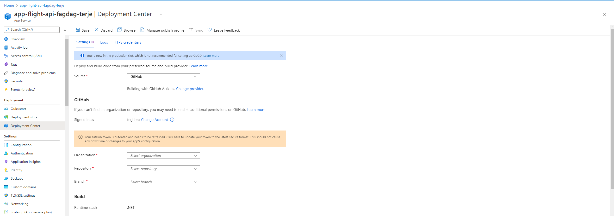
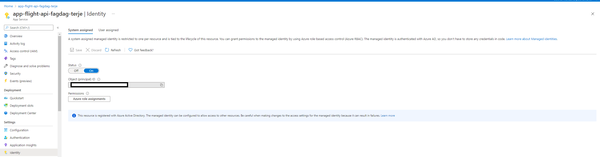
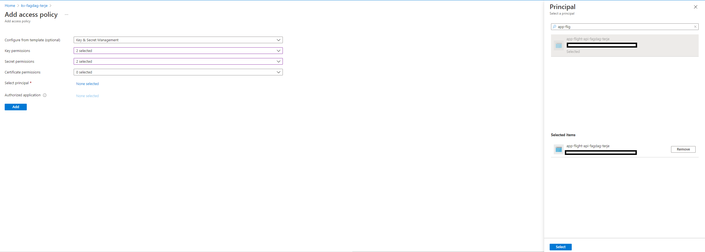
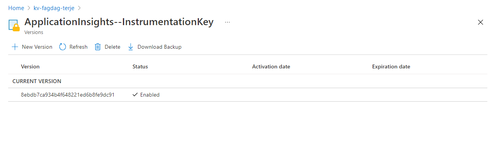
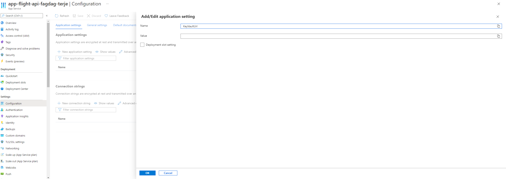

# WebApp og API

Denne branchen inneholder kode for en enkel webapp som benytter Flight.Api for å hente data. (Ligger også et Weather.APApiI her som også kan benyttes og integreres i løsningen)

## Github Actions: CI/CD oppsett

Lag to private repoer som skal benyttes til å lage CI/CD pipline for frontend og backend (Kan gjerne lage et også).

### Frontend

WebAppen deployes til en Azure Static WebApp som benytter private repo på Github for å sette opp en CI/CD pipeline. Lag derfor et privat repo på github, legg til frontend-koden, commit og push. Under opprettelsen av Azure Static WebApp blir du bedt om å git Azure tilgang til dette repoet for å sette opp Github-actions.

Det kan være du må gjøre justering på workin directory for filen som automatisk genereres under opprettelse av Static Web.

### Backend

Dette krever noe oppsett fra Github. Dersom man ikke ønsker dette, kan man publisere fra Visual Studio 2019

#### Azure AD

Dette må gjøres først: https://docs.microsoft.com/en-us/azure/developer/github/connect-from-azure

#### App-service

Gå til App-Service og velg **Deployment Center** og sett opp Github-konto



#### Endre workflow detaljer

Dette generere en workflow yml-fil. Denne må modiferes noe:

- Sett donet version 5.0.402
- Endre workingdirectory til katalogstrukturenen din

## Azure konfigurasjon

Nedefor brukes Portalen for å opprette alle ressurser samt ressursgruppe. Dersom du ønsker å scripte dette selv, må du gjerne gjøre det. Dette kalles gjerne Infrastructure as code (IaC). Dette kan gjøres ved hjelp av [Azure Powershell og Azure Cli](https://docs.microsoft.com/en-us/azure/azure-resource-manager/templates/), [Bicep](https://docs.microsoft.com/en-us/azure/azure-resource-manager/bicep/overview) eller ved å bruke tredjepartsløsnigner som [Pulumi](https://www.pulumi.com/docs/get-started/azure).

### Portal

Logg inn i [Azure portal](https://portal.azure.com/#home). Opprett en ressurs-gruppe som skal inneholde alle ressursene. I portalen kan man enkelt søke seg frem til de ulike ressursene man ønsker å opprette.

For navngiving se [her](https://docs.microsoft.com/en-us/azure/cloud-adoption-framework/ready/azure-best-practices/resource-abbreviations)

Velg ønsket Azure-region feks **North Europe**

- Opprett ressurs-gruppe
  - **rg-fagdag-`<gruppenavn>`**
- Opprett Key vault
  - **kv-fagdag-`<navn>`**
- Opprett Application Insight
  - **ai-fagdag-`<navn>`**
- Opprett Static WebApp (WebApp. Knytt opp mot Github og velg repo. Da opprettes det github CI/CD workflow)
  - **stapp-app-fagdag-`<navn>`**
- Opprett App Service (For API. .NET 5 Runtime og Windows)
  - App Service navn:
    - **app-flight-api-fagdag-`<navn>`**
  - App Plan-navn:
    - **plan-flight-api-fagdag-`<navn>`**

Dette gir da følgende innhold i ressurs-gruppen:


## Koble sammen

## Lese-tilgang til Key Vault

API-et benytter Key Vault for å hente ut Application Insights Instrumentation key. For at **app-flight-api-fagdag-`<navn>`** skal få tilgang til API-et må man benytte **Managed Identity**. Dette slås på i App Servicen:



Gir lese-rettigheter (Get og List) til Key Vault for App Service:



## Key Vault secret

Flight.Api benytter **Application Insights** . Legg inn Application Insights instrumentation nøkkel i key-vaulten og gi den navnet **ApplicationInsights--InstrumentationKey**.


## App Service konfigurasjon

Gå til app service og legge til ur-len til Key Vault:


## Github action

Gå til ditt private repo-et og finn katalogen **.github/workflows** og åpne workflow for frontend-appen. Der legger du inn URL-en til API-et som en miljøvariabel som Create-React-App leser ved bygging av frontenden:

```
   build_and_deploy_job:
    if: github.event_name == 'push' || (github.event_name == 'pull_request' && github.event.action != 'closed')
    runs-on: ubuntu-latest
    name: Build and Deploy Job
    steps:
      - uses: actions/checkout@v2
        with:
          submodules: true
      - name: Build And Deploy
        id: builddeploy
        uses: Azure/static-web-apps-deploy@v1
        with:
          azure_static_web_apps_api_token: ${{ secrets.AZURE_STATIC_WEB_APPS_API_TOKEN_SALMON_PLANT_072AB0203 }}
          repo_token: ${{ secrets.GITHUB_TOKEN }} # Used for Github integrations (i.e. PR comments)
          action: "upload"
          ###### Repository/Build Configurations - These values can be configured to match your app requirements. ######
          # For more information regarding Static Web App workflow configurations, please visit: https://aka.ms/swaworkflowconfig
          app_location: "/" # App source code path
          api_location: "" # Api source code path - optional
          output_location: "" # Built app content directory - optional
          ###### End of Repository/Build Configurations ######
        env:
          REACT_APP_FLIGHT_API_URL: "https://<uri>/api"
```
