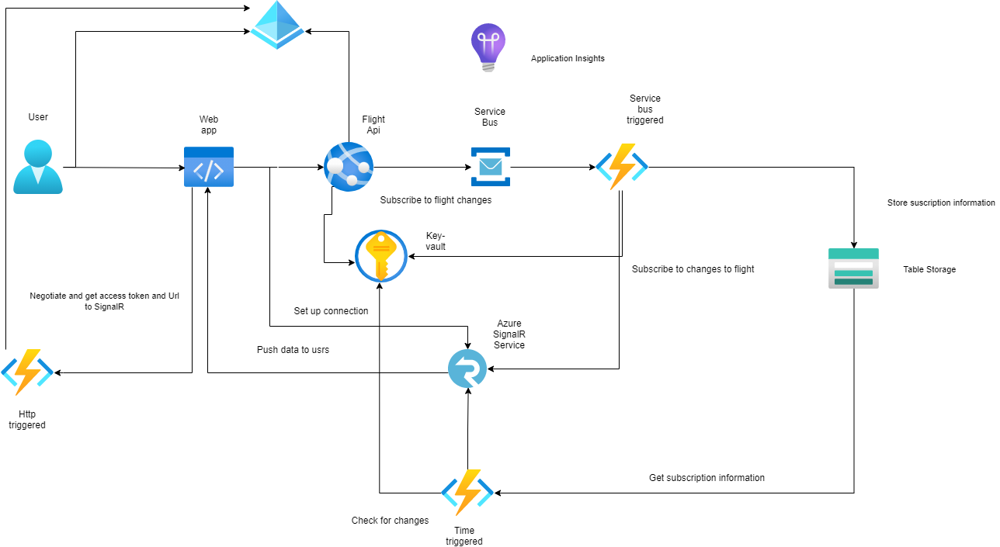

# Azure fagdag

Dette repoet kan brukes som et utgangspunkt på fagdagen.

Azure tjenester som benyttes i dette repo-et:

- Azure AD og App registration
- Static Web app
- App Service
- Application Insight
- Function App
- Key Vault
- Service Bus
- SignalR Service
- Table Storage

# Azure arkitektur

Nedefor vises Azure-tjenestene som er i bruk og samspilltet dem i mellom:

Ressursgruppe med ressurser:

## Kode

Repo-et inneholder backend- og frontendkode som man kan benyttes som utgangspunkt på fagdagen. Clone dette repoet og bruk backend- og frontendkoden som utgangspunkt repoet.For å sette opp CI/CD opprett eget privat repo på github.

Repoet inneholder følgende brancher:

- **01-webapp-and-webapi**
  - WebApp som benytter API
- **02-webapp-and-webapi-aad-auth**
  - WebApp som benytter API med autentisering
- **03-webapp-webapi-service-bus-signalr**
  - Hele løsningen

Branchene 02 og 03 bygger videre på forrige branch.

## Backend

### Flight.Api

API for å hente ut flyplasser, statuser og flyinformasjon. Benytter [Avinors Api](https://avinor.no/en/corporate/services/flydata/flydata-i-xml-format). Dette API-et benyttes av web-appen.

Tilbyr også et endepunkt for å få notifikasjoner når en flight endrer seg

### Weather.Api

API for å hente ut værvarsel for gitt lokasjon (lat, long). Benytter [Yrs Api](https://developer.yr.no/doc/GettingStarted/). Ikke brukt i eksempelet over, men utvid gjerne og knytt feks koordinater til flyplassene og hent ut værdata. (Benytt tabell i Azure Table Storage eller benytt Azure Sql Server)

### Notification

Inneholder Azure Functions som benyttes for å sette opp SignalR-forbindelse, for å håndtere subscriptions-informasjon og å sende ut notfikasjosner.

#### negotiate (Http-triggered)

Benyttes for å få tilgang til Azure SignalR Service.

#### notifications-queue (Service bus triggered)

Kjøres når nye meldinger kommer. Lagrer subscription-information (flyplass, flight og brukerid) i Azure Table Storage. Benytter Azure SignalR Service gruppefunksjonaltiet (flight-id og bruker-id) for å sende ut informasjon til riktig bruker for riktig fligth.

#### flight-monitor (time triggered)

Kjøres hvert 3. minutt\* (kan enkelt endres) og sjekker endringer i flyinformasjon. Henter opp subscription-informasjon fra Azure Table Storage og sender ut notfikasjoner via Azure SignalR Service.

## Frontend

Webapp hvor bruker velger flyplass og får opp alle flights fra angitt flyplass. Benytter Azure SignalR Service for notifikasjoner og Flight API for å hente flyplasser og flights.

## Ressurser

- [Microsofts learning paths](https://docs.microsoft.com/en-us/learn/browse)
- Pluralsight-kurs
  - [Microsoft Azure for .NET Developers - Cloud Patterns and Architecture](https://www.pluralsight.com/courses/microsoft-azure-dotnet-cloud-architecture-update)

Ellers finner man bra dokumentasjon generelt på Microsoft sine sider.

### Videre

Legg til flere Azure tjenester i løsningen. Feks:

- Nattlig jobb som henter dagens flydata og lagrer for fremtidig bruk
- Lagre data i SQL, NoSql eller Data Lake for videre prossesering
- Machine Learning eller annen analyse
