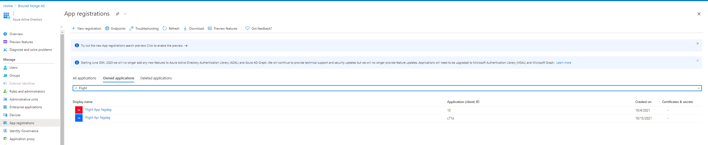
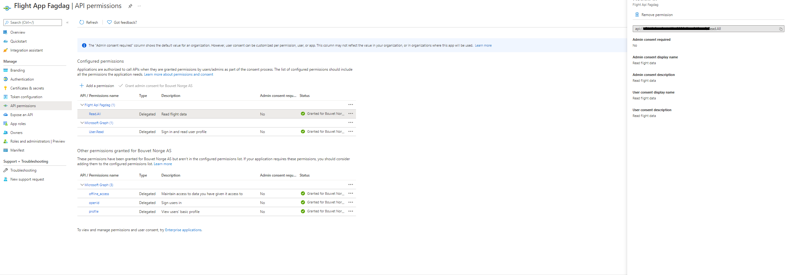

# WebApp og API med autentisering

Denne branchen fortsetter fra forrige. I denne branchen er Azure AD autentisering slått på

## Autentisering

Det er blitt opprett to Azure AD App registrering-er, **Flight App Fagdag** og **Flight Api Fagdag**. Disse er opprettet på forhånd da disse krever en administrator godkjennelse på forhånd. Dere må derfor benytte disse. Disse finner dere under **Azure AD** og fanen **App Registrations**.



**Flight App Fagdag** har følgende tillatelser:



WebAppen ber om token slik at den kalle benytte seg av WebAPI-en.

## WebApp

Gå inn på **Flight App Fagdag** under App Registrations i Azure AD. Hent ut **ClientId** og **TentantId** og **Webapi scope** for **Flight App Fagdag**.
Legg inn **REACT_APP_CLIENT_ID** og **REACT_APP_TENANT_ID**, **REACT_APP_API_SCOPE** i Github-workflowen.

### Eksempelfil

```yml
name: Azure Static Web Apps CI/CD

on:
  push:
    branches:
      - main
  pull_request:
    types: [opened, synchronize, reopened, closed]
    branches:
      - main

jobs:
  build_and_deploy_job:
    if: github.event_name == 'push' || (github.event_name == 'pull_request' && github.event.action != 'closed')
    runs-on: ubuntu-latest
    name: Build and Deploy Job
    steps:
      - uses: actions/checkout@v2
        with:
          submodules: true
      - name: Build And Deploy
        id: builddeploy
        uses: Azure/static-web-apps-deploy@v1
        with:
          azure_static_web_apps_api_token: ${{ secrets.AZURE_STATIC_WEB_APPS_API_TOKEN_SALMON_PLANT_072AB0203 }}
          repo_token: ${{ secrets.GITHUB_TOKEN }} # Used for Github integrations (i.e. PR comments)
          action: "upload"
          ###### Repository/Build Configurations - These values can be configured to match your app requirements. ######
          # For more information regarding Static Web App workflow configurations, please visit: https://aka.ms/swaworkflowconfig
          app_location: "/" # App source code path
          api_location: "" # Api source code path - optional
          output_location: "" # Built app content directory - optional
          ###### End of Repository/Build Configurations ######
        env:
          REACT_APP_FLIGHT_API_URL: "https://`<url>`/api"
          REACT_APP_CLIENT_ID: "xx"
          REACT_APP_TENANT_ID: "yy"
          REACT_APP_API_SCOPE: "api://`<id>`/Read.All"

  close_pull_request_job:
    if: github.event_name == 'pull_request' && github.event.action == 'closed'
    runs-on: ubuntu-latest
    name: Close Pull Request Job
    steps:
      - name: Close Pull Request
        id: closepullrequest
        uses: Azure/static-web-apps-deploy@v1
        with:
          azure_static_web_apps_api_token: ${{ secrets.AZURE_STATIC_WEB_APPS_API_TOKEN_SALMON_PLANT_072AB0203 }}
          action: "close"
```

## API

Gå inn på **Flight Api Fagdag** og hent ut **TenantId** samt **Application ID URI** (under _Expose an API_). Lag henholdsvis to ny secrets i KeyVault: **AzureAd--TentantId** og **AzureAd--Audience**.

Restart App Servicen.
