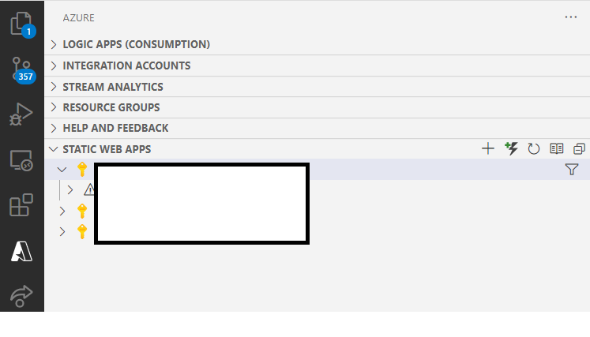

# WebApp og API

Denne branchen inneholder kode for en enkel webapp som benytter Flight.API for å hente data. (Ligger også et Weather API her som også kan benyttes og integreres i løsnignen )

## Før du starter

Denne løsningen benytter Azure Static WebApp som benytter private repo på Github for å sette opp en CI/CD pipeline. Lag et privat repo på github, legg til frontend-koden, commit og push.

## Azure konfigurasjon

### Portal

Logg inn i [Azure portal](https://portal.azure.com/#home) for å opprette ressurs-gruppe. Alle ressursene skal legges i denne gruppen. I portalen kan man enkelt søke seg frem til de ulike ressursene man skal opprette.

For navngiving se [her](https://docs.microsoft.com/en-us/azure/cloud-adoption-framework/ready/azure-best-practices/resource-abbreviations)

Velg ønsket Azure-region feks **North Europe**

- Opprett ressurs-gruppe
  - **rg-fagdag-`<gruppenavn>`**
- Opprett Key vault
  - **kv-fagdag-`<navn>`**
- Opprett Application Insight
  - **ai-fagdag-`<navn>`**
- Opprett Static WebApp (WebApp. Knytt opp mot Github og velg repo. Da opprettes det github CI/CD workflow)
  - **stapp-app-fagdag-`<navn>`**
- Opprett App Service (For API. .NET 5 Runtime og Windows)
  - App Service navn:
    - **app-flight-api-fagdag-`<navn>`**
  - App Plan-navn:
    - **plan-flight-api-fagdag-`<navn>`**

Dette gir da følgende innhold i ressurs-gruppen:


### Scripting

Alt dette kan også scriptes. Dette kalles gjerne Infrastructure as code (IaC). Dette kan gjøres ved hjelp av Azure Powershell, Azure Cli, Rest-API-er eller ved å bruke tredjepartsløsnigner som [Pulumi](https://www.pulumi.com/docs/get-started/azure).

## Koble sammen

## Lese-tilgang til Key-vault

API-et benytter keyvault for å hente ut Application Insights Instrumentation key. For at app-flight-api-fagdag-`<navn>` skal få tilgang til API-et må man benytte \*\*Managed Identity". Dette slås på på App Servicen:


Gir lese-rettigheter til Key-vault for App Service:


## App Service konfigurasjon

Gå til app service og legge til urlen til key-vaulten:

'

## Github action

Endre workflowen slik at miljøvariabler legges inn:

```
   build_and_deploy_job:
    if: github.event_name == 'push' || (github.event_name == 'pull_request' && github.event.action != 'closed')
    runs-on: ubuntu-latest
    name: Build and Deploy Job
    steps:
      - uses: actions/checkout@v2
        with:
          submodules: true
      - name: Build And Deploy
        id: builddeploy
        uses: Azure/static-web-apps-deploy@v1
        with:
          azure_static_web_apps_api_token: ${{ secrets.AZURE_STATIC_WEB_APPS_API_TOKEN_SALMON_PLANT_072AB0203 }}
          repo_token: ${{ secrets.GITHUB_TOKEN }} # Used for Github integrations (i.e. PR comments)
          action: "upload"
          ###### Repository/Build Configurations - These values can be configured to match your app requirements. ######
          # For more information regarding Static Web App workflow configurations, please visit: https://aka.ms/swaworkflowconfig
          app_location: "/" # App source code path
          api_location: "" # Api source code path - optional
          output_location: "" # Built app content directory - optional
          ###### End of Repository/Build Configurations ######
        env:
          REACT_APP_FLIGHT_API_URL: "https://<uri>/api"
```

## Deploye kode

Kode kan deployes direkte fra Visual Studio, Azure Devops og Pipelines eller feks [Github Actions](https://docs.microsoft.com/en-us/azure/developer/github/github-actions).

### Backend (Visual Studio 2019)

Logg inn i Visual Studio med Bouvet-bruker og hhøreklikk på prosjektet og trykk "Publish". Velg riktig subscription og browser til App Service og deploy.

## Frontend (Visual Code)

Installer [Azure Static Web Apps extension](https://marketplace.visualstudio.com/items?itemName=ms-azuretools.vscode-azurestaticwebapps)

Logg inn via extensions og velg "fanen" \*_Static Web Apps_

