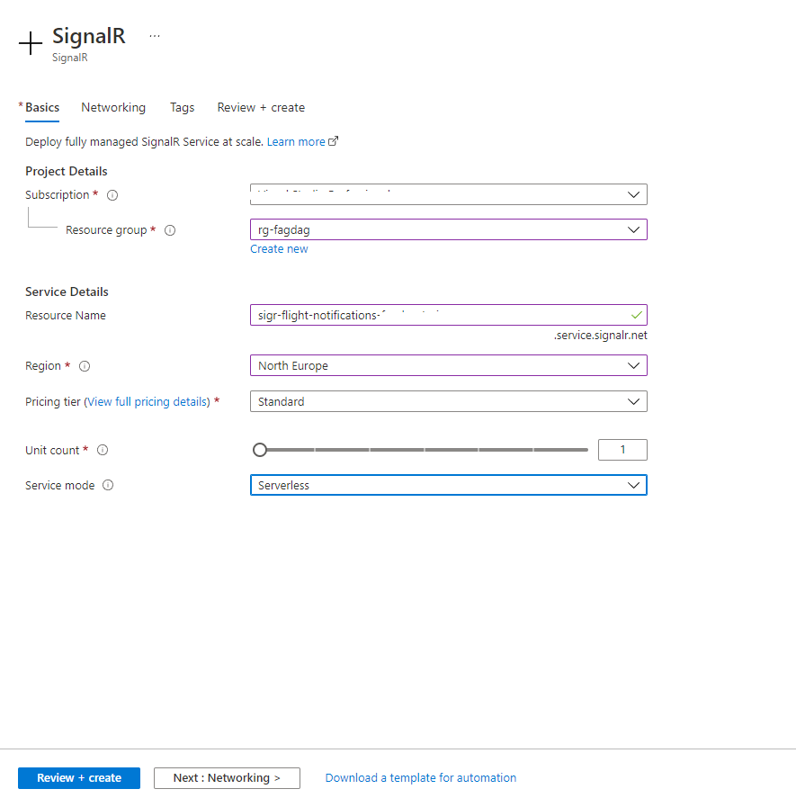
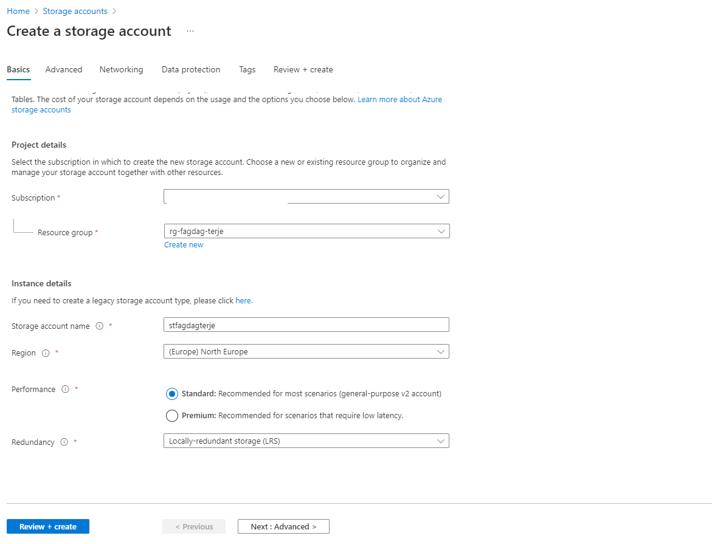
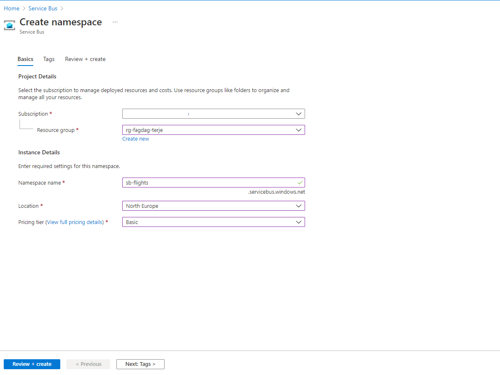
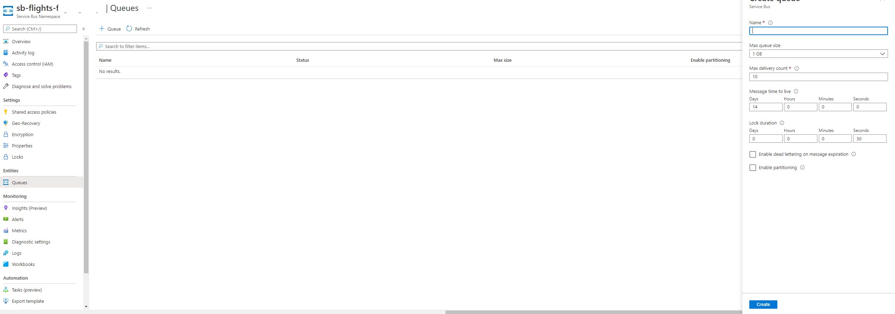
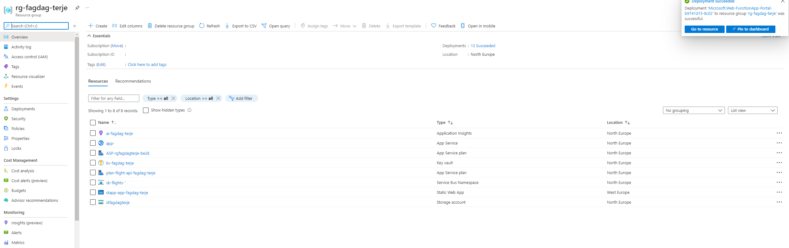
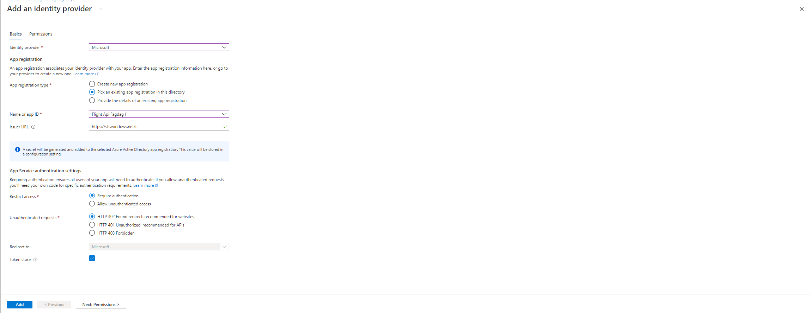

# WebApp, API, Service Bus, SignalR og Azure Functions

Denne branchen fortsetter fra forrige. I denne branchen brukes Azure Service Bus, SignalR
Azure Functions (time, http, and service bus triggere) samt Azure Table Storage

### Azure konfigurasjon

### Portal

Logg inn i [Azure portal](https://portal.azure.com/#home). Forutsetter at ressursgruppe og ressurser fra **01-webapp-and-webapi** er opprettet. Hvis ikke se README i branch 01.

For navngiving se [her](https://docs.microsoft.com/en-us/azure/cloud-adoption-framework/ready/azure-best-practices/resource-abbreviations)

- Opprett Azure SignalR Service (serverless)
- **sigr-`<navn>`**
  
- Opprett Storage account
  - **st`<navn>`** (merk ikke tillatt med "-")
    
- Opprett Service Bus ressurser

  - Namespace:
    - **sb-`<navn>`**
      
  - Queue(flight-notifications-queue):
    

- Opprett Function App (**Hosting**: velg storage account-en som allerede er opprettet. **Monitoring**: velg Application insight som er oppprett tidligere. Velg App Service plan som ble opprettet tidligere)
  - **func-`<navn>`**
    

Dette gir da følgende innhold i ressurs-gruppen:



## Key Vault

Legge inn connection strings fra SignalR, Storage Account og Service Bus (Kan gjerne lag ny shared access policy med begrensede rettighter) i Key-vault og gi dem følgende navn:

- AzureSignalRConnectionString
- AzureWebJobsStorage
- ServiceBus--ConnectionString
- ServiceBus--QueueName

### Konfigurere Function App

#### Key Vault

- Under "Access policies" -> Legg til ny (Se branch 01 for hvordan dette gjøres). Søk opp navn på func eller eller benytte service principal id

### App setting

Legg til Key Vault referanse i **Application Settings** underer **Configuration**:

- AzureSignalRConnectionString
- AzureWebJobsStorage
- AzureWebJobsServiceBus (benytt ServiceBus--ConnectionString)
- QueueName benytt (ServiceBus--QueueName)

For hver av dem referer til Key Vault slik:

```
@Microsoft.KeyVault(VaultName=myvault;SecretName=mysecret)
```

Dersom func-en har rettigheter til å lese fra Key Vault vil det se slik ut:


## CORS

Legg inn url til frontend eller \* (!)

Dersom func-en har rettigheter til å lese fra key-vault vil det se slik ut


## Frontend

Legg til ny miljøvariabel i github workflow:

**REACT_APP_SIGNAL_R_NEGOTIATE_URL**

Urlen er på formatet: **https://`<funcnavn>`/api/flightnotifications/negotiate/**

(flightnotifications er navnet på hub-en)

## CI/CD

### Function App

Beskrivelsen nedefor tar utgangspunkt i dette [dokumentet](https://docs.microsoft.com/en-us/azure/azure-functions/functions-how-to-github-actions?tabs=dotnet)

Gå til Function App og velg **Deployment Center** og sett opp Github-konto


Dette generere en workflow yml-fil. Denne må muligens modiferes noe. Se over følgende:

- DOTNET_CORE_VERSION 2.2
- Endre workingdirectory som passer katalogstrukturenen din

#### Eksempelfil

```yml
# Docs for the Azure Web Apps Deploy action: https://github.com/azure/functions-action
# More GitHub Actions for Azure: https://github.com/Azure/actions

name: Build and deploy dotnet core app to Azure Function App - func-flights-fagdag-terje

on:
  push:
    branches:
      - main
  workflow_dispatch:

env:
  AZURE_FUNCTIONAPP_PACKAGE_PATH: "Notification" # set this to the path to your web app project, defaults to the repository root
  DOTNET_VERSION: "2.2.402"

jobs:
  build-and-deploy:
    runs-on: windows-latest
    steps:
      - name: "Checkout GitHub Action"
        uses: actions/checkout@v2

      - name: Setup DotNet ${{ env.DOTNET_VERSION }} Environment
        uses: actions/setup-dotnet@v1
        with:
          dotnet-version: ${{ env.DOTNET_VERSION }}

      - name: "Resolve Project Dependencies Using Dotnet"
        shell: pwsh
        run: |
          pushd './${{ env.AZURE_FUNCTIONAPP_PACKAGE_PATH }}'
          dotnet build --configuration Release --output ./output
          popd

      - name: "Run Azure Functions Action"
        uses: Azure/functions-action@v1
        id: fa
        with:
          app-name: "func-flights-fagdag-terje"
          slot-name: "Production"
          package: "${{ env.AZURE_FUNCTIONAPP_PACKAGE_PATH }}/output"
          publish-profile: ${{ secrets.AZUREAPPSERVICE_PUBLISHPROFILE_F4C258C64B714F8288475FC33BF61303 }}
```

### WebApp workflow

Legg til ny miljøvariebel i github workflow:

**REACT_APP_SIGNAL_R_NEGOTIATE_URL**

Urlen er på formatet: **https://<funcnavn>/api/flightnotifications/negotiate/**

(flightnotifications er hubnavn)

Gir da følgende fil:

```yml
name: Azure Static Web Apps CI/CD

on:
  push:
    branches:
      - main
  pull_request:
    types: [opened, synchronize, reopened, closed]
    branches:
      - main

jobs:
  build_and_deploy_job:
    if: github.event_name == 'push' || (github.event_name == 'pull_request' && github.event.action != 'closed')
    runs-on: ubuntu-latest
    name: Build and Deploy Job
    steps:
      - uses: actions/checkout@v2
        with:
          submodules: true
      - name: Build And Deploy
        id: builddeploy
        uses: Azure/static-web-apps-deploy@v1
        with:
          azure_static_web_apps_api_token: ${{ secrets.AZURE_STATIC_WEB_APPS_API_TOKEN_SALMON_PLANT_072AB0203 }}
          repo_token: ${{ secrets.GITHUB_TOKEN }} # Used for Github integrations (i.e. PR comments)
          action: "upload"
          ###### Repository/Build Configurations - These values can be configured to match your app requirements. ######
          # For more information regarding Static Web App workflow configurations, please visit: https://aka.ms/swaworkflowconfig
          app_location: "/" # App source code path
          api_location: "" # Api source code path - optional
          output_location: "" # Built app content directory - optional
          ###### End of Repository/Build Configurations ######
        env:
          REACT_APP_FLIGHT_API_URL: "https://`<url>`/api"
          REACT_APP_SIGNAL_R_NEGOTIATE_URL: "https://`<url>`/api/flightnotifications/negotiate/"
          REACT_APP_CLIENT_ID: "xx"
          REACT_APP_TENANT_ID: "yy"
          REACT_APP_API_SCOPE: "api://`<id>`/Read.All"

  close_pull_request_job:
    if: github.event_name == 'pull_request' && github.event.action == 'closed'
    runs-on: ubuntu-latest
    name: Close Pull Request Job
    steps:
      - name: Close Pull Request
        id: closepullrequest
        uses: Azure/static-web-apps-deploy@v1
        with:
          azure_static_web_apps_api_token: ${{ secrets.AZURE_STATIC_WEB_APPS_API_TOKEN_SALMON_PLANT_072AB0203 }}
          action: "close"
```

## Azure Function autentisering

For å beskytte HTTP-trigger Azure Function-en benyttes App Service autentisering elelr Easy-Auth. Gå inn på Function Appen. Velg **Authentication** og trykk på **Add Identity Provider**. Velg eksisterende App registration og velg **Flight API FagDag** (Kunne opprettet egen også).


Trykk **Add**.

Velg "Edit" og legg inn **Audience** (API-SCOPE), fra forrige branch, under **Allowed token audiences**.

## Table storage

Alle subscriptions blir lagret her. Last ned [her](https://azure.microsoft.com/en-us/features/storage-explorer/) og gå til tabellen **subscriptions** for å se data.

Legg inn url til frontend eller \* (!)


